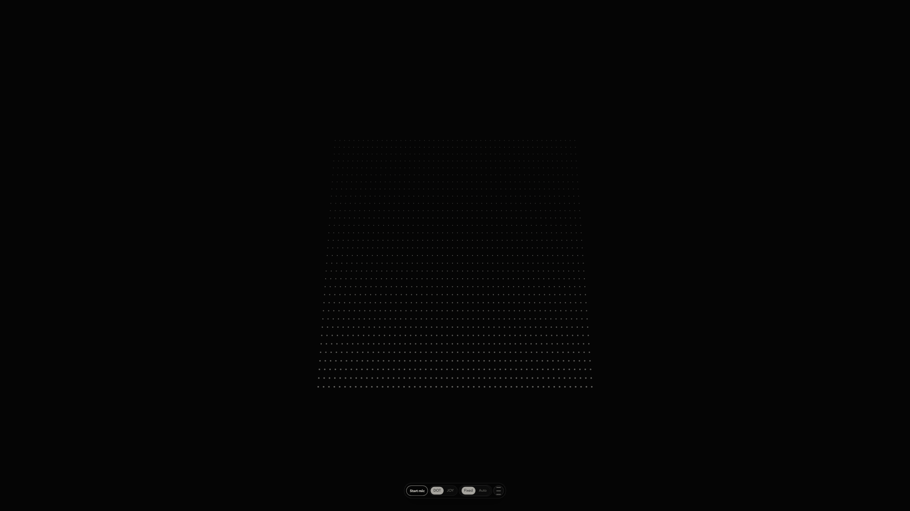

# Tacitum

Tacitum is a real-time browser audio visualizer for conversational listening states.

It transforms live audio into two expressive modes:
- DOT: a ripple-driven depth plane with controllable lift and flow behavior
- JOY: a topographic field for broader ambient shape and energy

Built with TypeScript + Vite, Tacitum is designed for fast local iteration, deterministic model tests, and production deployment on Vercel.

## Live Demo

- Production demo: https://tacitum.vercel.app

## Screenshots

### Desktop



### Mobile


## Core Features

- Real-time microphone or shared tab-audio analysis and visualization
- Two visual modes (DOT / JOY)
- Fine-grained controls for sensitivity, lift, speed, zoom, and browser audio source
- Camera controls with drag rotation, zoom, and optional ambient auto motion
- Persistent control state in local storage with migration safeguards
- Strong unit test coverage for audio math, visual geometry, camera behavior, and state machines

## Tech Stack

- TypeScript
- Vite
- Vitest

## Getting Started

### Prerequisites

- Node.js 20+
- npm 10+

### Install

```bash
npm install
```

### Run local development

```bash
npm run dev
```

### Run tests

```bash
npm test
```

### Build for production

```bash
npm run build
```

## Project Structure

- src/app: app shell and control panel wiring
- src/audio: input, analysis, and signal math
- src/speech: speech-state modeling and buffering
- src/visual: renderer, camera, geometry, and DOT/JOY field models
- src/types: shared domain types
- docs: implementation specs and screenshots

## Status

Tacitum is production-deployed and actively refined for visual continuity, smooth camera behavior, and externally shareable repository quality.
